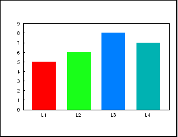

import { Appear, Notes, Image } from "mdx-deck";
import {
  Split,
  SplitRight,
  FullScreenCode,
  Horizontal
} from "mdx-deck/layouts";
import { CodeSurfer } from "mdx-deck-code-surfer";
import { book } from "mdx-deck/themes";
import nightOwl from "prism-react-renderer/themes/nightOwl";

import Disappear from "components/deck/Disappear";
import CodeSurferContainer from "components/deck/CodeSurferContainer";

export const theme = {
  ...book,
  codeSurfer: { ...nightOwl, showNumbers: false }
};

# Hooked on D3

## Creating Animated Ch(art)s with D3 and React Hooks

<Notes>

- Only visible in presenter mode
- Markdown syntax can be used with empty lines around the content

</Notes>

---

# Hi, I'm Monica

<Appear>
  <div>
    
  </div>
  <h2>Polish 🇵🇱 /American 🇺🇸</h2>
  <h2>Outdoors</h2>
  <h2>some other emoji about me</h2>
</Appear>

---

<div>
  
  <Appear>
    <h2>There has to be a better way</h2>
  </Appear>
</div>

<Notes>

- my journey with programming began in college when I was a research assistant tasked with showing some data..
- I thought, there has to be something better than this...

</Notes>

---

<div>
  
</div>

<Notes>

- and there was!
- luckily I was thinking out loud and happened to have a computer science roommate who pointed me in the direction of this site
- since then, I've been hooked on D3... and today I'm hooked on D3 and React together :)

</Notes>

---

<Appear>
  <h1>⚛️</h1>
  <div>
    
  </div>
  <h1>👨‍🍳 🍳 👩‍🍳</h1>
  <h1>?</h1>
</Appear>

<Notes>

- so today, I want to chat about React and the data visualization lib D3, but also...
- And today, other than talking to you about code, I’ll be sharing some secrets of the art of cooking at a 5-star restaurant…
- So keep that in mind

</Notes>

---

import BoldingText from "components/deck/BoldingText";

<BoldingText />

<Notes>

- But before we jump right into what the title of this presentation promised, “Creating Animated Ch(art)s with D3 and React hooks”, I think we need to take a step back and focus on one word: Animated
- So what is animation but...

</Notes>

---

<h2>
  <strike>Time and Change</strike> Change / Time
</h2>

<Notes>

- Time and Change = Transformation
- Actually Change / Time = Transformation

</Notes>

---

## Why animate?

<ul>
  <Appear>
    <li>🔅 🔆 continuity</li>
    <li>🔄 action / reaction</li>
    <li>🕓 motion</li>
  </Appear>
</ul>

<Notes>

- provides a visual cue of continuity; it's one object
- A reaction to our action (communication of cause-and-effect)
- Motion: A clue that ‘something is happening’ (e.g. Loading component); relationship with time

</Notes>

---

import { Circles, AnimatedCircle } from "components/Circle";

<h2>
  MORE information
  <Appear>
    <span>...but LESS to process at once</span>
  </Appear>
</h2>

<div>
  <Circles />
</div>

<Appear>
  <div>
    <AnimatedCircle />
  </div>
</Appear>

<Notes>

- MORE INFORMATION (not just the snapshots of reality, but their collection)
- …but LESS TO PROCESS AT ONE TIME (our eye then only needs to follow one piece of information, not two simultaneously
- It hints that the takeaway is not in each single frame, but in the space between them. In their relation to one another.

</Notes>

---

# Animation in charts?

<Notes>

so then how does this apply to data visualization?

</Notes>

---

<h2></h2>

<div style={{ width: "100vw", height: "80vh", position: "relative" }}>
  <div
    style={{
      position: "absolute",
      width: "100%",
      height: "100%",
      backgroundSize: "cover",
      backgroundImage: "url(./images/chefs_and_spices.jpg)"
    }}
  />
  <div
    style={{
      position: "absolute",
      background: "#fffceb",
      width: "400px",
      height: "100vh"
    }}
  />
  <div
    style={{
      position: "absolute",
      background: "#fffceb",
      width: "450px",
      height: "100vh",
      left: "1000px"
    }}
  />
</div>

<Notes>

- salt and spices represent two different approaches to animation in data visualization.
- And just like a balance of salt and spices wins out in the long run in terms of cooking, this balance is a winner when it comes to ‘when and how to animate charts’ as well
- What do I mean?
  - Salt enhances the underlying elements, but it does not overshadow them
  - Spices, change the flavor profile; they bring your senses to different features
  - It’s actually a combo of salt and spices. We want to direct and disturb focus in the appropriate manner.
- But the trick isn’t just to add salt and add spices, but to add them where they are applicable (there is information in the way you share information)

</Notes>

---

## _When to add_ salt and spices?

<div style={{ width: "100vw", height: "80vh", position: "relative" }}>
  <div
    style={{
      position: "absolute",
      width: "100%",
      height: "100%",
      backgroundSize: "cover",
      backgroundImage: "url(./images/chefs_and_spices.jpg)"
    }}
  />
  <div
    style={{
      position: "absolute",
      background: "#fffceb",
      width: "400px",
      height: "100vh"
    }}
  />
  <div
    style={{
      position: "absolute",
      background: "#fffceb",
      width: "450px",
      height: "100vh",
      left: "1000px"
    }}
  />
  <Appear>
    <div
      style={{
        position: "absolute",
        width: "400px",
        top: "100px"
      }}
    >
      <ul>
        <li>
          <h1>A -> B </h1>
        </li>
      </ul>
    </div>
    <div
      style={{
        position: "absolute",
        width: "450px",
        left: "1000px",
        top: "100px"
      }}
    >
      <ul>
        <li>
          <h1>
            a<sub>x</sub> -> a<sub>y</sub>
          </h1>
        </li>
      </ul>
    </div>
    <div
      style={{
        position: "absolute",
        width: "450px",
        left: "1000px",
        top: "200px"
      }}
    >
      <ul>
        <li>
          <h1>a(t)</h1>
        </li>
      </ul>
    </div>
    <div
      style={{
        position: "absolute",
        width: "400px",
        top: "200px"
      }}
    >
      <ul>
        <li>
          <h1>aaa look here! 👀</h1>
        </li>
      </ul>
    </div>
  </Appear>
</div>

<Notes>

- aka when to add animation to data visualization
- The wrong approach: ‘what animation should we add’ (what spices should we add?)
- The right approach: ‘what animation is our data holding/calling for’ (what are the ingredients asking for?)
  - Transitioning between states (change within group) -> object continuity (A -> A)
    - Position change
    - Shows relationship because it maintains my focus on particular elements
  - Transitioning between states (change of group) (A -> B)
    - Dataset change
    - Shows lack of a relationship between A and B because it interrupts my focus on particular elements
  - Animation as explanation (narration, storytelling)
  - Transition over time (real-time data) NICU (same dataset, but growing)
- It really comes down to three places where animation can add be used to enhance its underlying elements:
  - 1. New dataset (spice, interrupt my current focus, change the flavor)
  - 2. New element in dataset (aka change to dataset) (salt / spice?)
  - 3. Change to element in dataset (salt, maintain my current focus)

</Notes>

---

## _How_ to add salt and spices?

<div style={{ width: "100vw", height: "80vh", position: "relative" }}>
  <Disappear
    elementsToKeep={[
      <div
        style={{
          position: "absolute",
          width: "100%",
          height: "100%",
          backgroundSize: "cover",
          backgroundImage: "url(./images/chefs_and_spices.jpg)"
        }}
      />
    ]}
    elementsToRemove={[
      <div>
        <div
          style={{
            position: "absolute",
            background: "#fffceb",
            width: "400px",
            height: "100vh"
          }}
        />
        <div
          style={{
            position: "absolute",
            background: "#fffceb",
            width: "450px",
            height: "100vh",
            left: "1000px"
          }}
        />
      </div>
    ]}
  />
</div>

<Notes>

- aka. how to add animation to data visualisations
- So now we understand that animation can add a lot to a visualization, which is great, but it would probably be helpful to know how to implement this as well ;)
- We talked about spices and salt, so let’s take a look at who would be adding those to a dish:
- this is where our chefs come in!

</Notes>

---

# Two cooks 👨‍🍳 👨‍🍳

<Appear>
  <h1>...one kitchen.</h1>
</Appear>

<Notes>

- have you ever heard the saying, you can’t have two cooks in the kitchen?
- It makes sense right? How can you have one pot, one knife, one cutting board, one set of ingredients, and expect two cooks to create a dish?
- (insert image of two chefs)
- a brief descrription of our two cooks: react (faux DOM) and D3 (DOM)
- There are three ways this situation could play out:

</Notes>

---

export default Split;

<div
  style={{
    margin: "2em"
  }}
>
  <h2>Option 1:</h2>
  <h1>Cook #1 takes control</h1>
</div>


<Notes></Notes>

---

<CodeSurferContainer>
  <CodeSurfer
    title="Right side"
    code={require("!raw-loader!components/App/App.js").default}
    lang="javascript"
    showNumbers={false}
    dark={true}
    steps={[
      { notes: "Start with this note" },
      { lines: [6], notes: "Note for the first step" },
      { range: [5, 9] },
      { tokens: { 9: [3, 4, 5] }, notes: "Note for the third step" }
    ]}
  />
</CodeSurferContainer>

---

export default Split;

<div
  style={{
    margin: "2em"
  }}
>
  <h2>Option 2:</h2>
  <h1>Cook #2 takes control</h1>
</div>


<Notes></Notes>

---

<CodeSurfer
  title="Right side"
  code={require("!raw-loader!components/App/App.js").default}
  lang="javascript"
  showNumbers={false}
  dark={true}
  steps={[
    { notes: "Start with this note" },
    { lines: [6], notes: "Note for the first step" },
    { range: [5, 9] },
    { tokens: { 9: [3, 4, 5] }, notes: "Note for the third step" }
  ]}
/>

---

export default SplitRight;

<div>
  
  
</div>

<div
  style={{
    margin: "2em"
  }}
>
  <h2>Option 3:</h2>
  <h1>Cook #1 and Cook #2 share control</h1>
</div>

<Notes>

- React (cook1) preps the ingredients and the pot, D3 (cook2) puts everything in its place

</Notes>

---

<CodeSurfer
  title="Right side"
  code={require("!raw-loader!components/App/App.js").default}
  lang="javascript"
  showNumbers={false}
  dark={true}
  steps={[
    { notes: "Start with this note" },
    { lines: [6], notes: "Note for the first step" },
    { range: [5, 9] },
    { tokens: { 9: [3, 4, 5] }, notes: "Note for the third step" }
  ]}
/>

---

export default SplitRight;

<div>
  <Appear>
    
    
  </Appear>
</div>

<div
  style={{
    margin: "2em"
  }}
>
  <h2>Option 3 with Hooks:</h2>
  <h1>CHEF and SOUS CHEF</h1>
</div>

<Notes>

- But there’s a difference between working together, and working together in an straightforward, predictable, organised manner:
- not Cook1 and Cook2 but chef and jeux chef!
- They need clear communication in order to make their collaboration work. This is where React Hooks come in!
- The chef (React) tells the jeux chef (D3) when it needs his/her help, and then gives it free reign to work it’s magic
- React prepares the dish and D3 adds the embellishments, the animations
  - Everything the jeux chef does is a side effect, he is making changes to the dish that the chef didn’t make himself
  - But just like in the kitchen, it’s best if one cook adds the spices, so too is true in data viz. react gives the cue, the recipe, and d3 adds the salt and spices.

</Notes>

---

<CodeSurfer
  title="Right side"
  code={require("!raw-loader!components/App/App.js").default}
  lang="javascript"
  showNumbers={false}
  dark={true}
  steps={[
    { notes: "Start with this note" },
    { lines: [6], notes: "Note for the first step" },
    { range: [5, 9] },
    { tokens: { 9: [3, 4, 5] }, notes: "Note for the third step" }
  ]}
/>

---

import App from "./components/App/App";

## <App />

<Notes>

- This is what we will be preparing today: The Non-boring Keyboard ala Monica :)
  - the inspiration for this dish is the question ‘how come the keyboard is laid out the way it is?’
  - Description:
    - Each key on my keyboard represents a bar/column in the chart
    - When each key is hit, the bar grows and then falls again (to show that something is being added) and a point is added above it so that we get the distribution of keys over time
    - We can view the data in several ways
      - x-axis is letter order, either based on the keyboard left to right or based on the English alphabet
      - y-axis is either the index of the element added (so we can see a distribution of letters over time) or the cumulative view (so we can see which letters are used most often)
- So let’s make it! to begin, we’re gonna let the chef set things up for us:
  - Sets up the recipe
    - Data useState
  - Gets the pot ready
    - Sets up dimensions
    - Create SVG container
  - Maps the recipe elements to ingredients
    - Create elements based on that data
- Now the chef needs to tell the jeux chef where and when he can take control
  - useRef (where)
  - useEffect (when)
- And when it’s his time, the jeux chef works his magic
  - updateFunction

</Notes>

---

<Appear>
  - Animation (salt and spices) - No two cooks in the kitchen - Chef and jeux
  chef need to have proper communication / delegation of responsibilities for a
  dish to taste good :) - Bon appetit XD
</Appear>

<Notes>

-To Summarize:

- Animation (salt and spices)
  - When it comes to charts, with animation we’re really talking about animated transitions (make visual changes natural/seamless to keep us immersed, a unified whole, a ‘continuation’ of the story). Spices and salt, (animations) should serve to unify the whole. No longer separate ingredients, but a unified flavour profile.
- No two cooks in the kitchen
  - If you’re using D3 with React, put it in its place! It’s a side effect because it affects the DOM in ways outside of directly React. So place it in useEffect
    - “Anything that results in changes that can be observed when the calculation is completed, beside the return value of the calculation itself, is a side effect.”
    - “Calculation should return just result of the calculation. Anything else is side-effect.”
- Chef and jeux chef need to have proper communication / delegation of responsibilities for a dish to taste good :)
  - Chef:
    - useState, useRef, useEffect
  - Jeux Chef:
    - Update function
- Bon appetit XD

</Notes>

---

import { LiveProvider, LiveEditor, LiveError, LivePreview } from "react-live";

### <a href="https://github.com/formidablelabs/react-live" target="_blank">react-live</a>

<br />

<LiveProvider code="<strong>Hello World!</strong>">
  <LiveEditor />
  <LiveError />
  <br />
  <LivePreview />
</LiveProvider>

---

## In fact...

This is an mdx-deck presentation.

```

```
